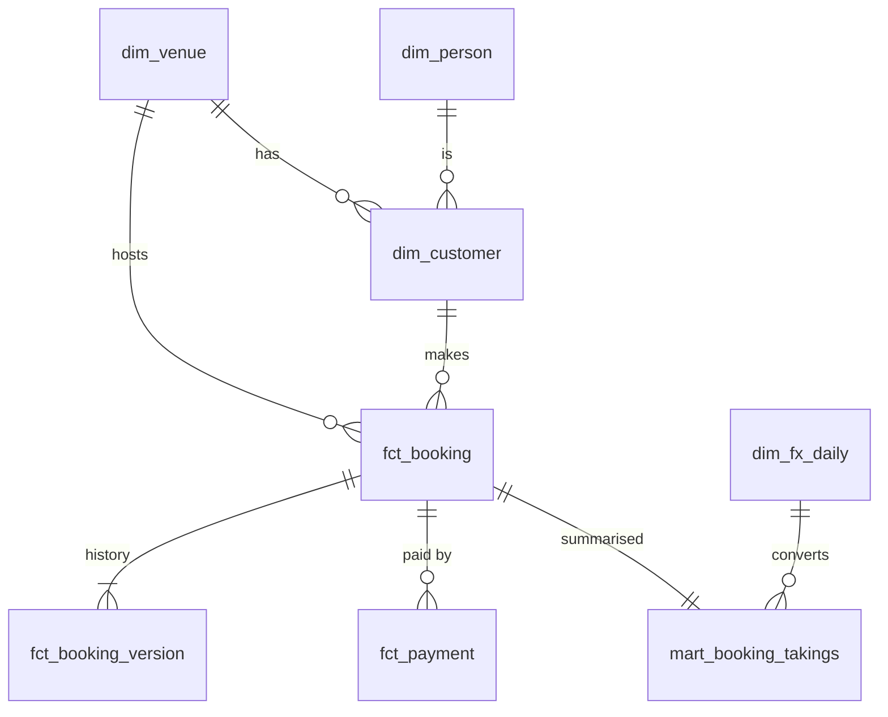

# Fernhill Leisure Group – Booking Warehouse

One warehouse for two booking platforms: **Hopscotch** (activity operators) and **Apex** (go-kart tracks). It loads both sources, lines them up in a shared model, checks the data and answers the four business questions.

- [How to run](#how-to-run)
- [Model](#model)
- [Data quality checks](#data-quality-checks)
- [Answers](#answers)
- [Write-up](#write-up)
- [Use of AI](#use-of-ai)

## How to run

Needs the [DuckDB CLI](https://duckdb.org/docs/installation/) (tested with v1.5.6, on Windows and Linux). Nothing else.

From the repo root:

```
duckdb warehouse.duckdb -f build.sql
```

This rebuilds everything from the CSVs in `data/`, runs the checks and prints the four answers. It also writes them to `results/`. If any error-level check fails, the build stops with a non-zero exit code and names the failing check. `warehouse.duckdb` is not committed.

To browse the tables afterwards: `duckdb warehouse.duckdb -ui`.

```
data/                source CSVs, as delivered
sql/01_raw/          load files as-is (all text) + lineage columns
sql/02_staging/      types, dedup, UTC + local time, signed money, email cleanup (views)
sql/03_core/         the shared model (tables)
sql/04_checks/       data quality checks
sql/05_answers/      one query per business question
results/             answer outputs (CSV)
build.sql            runs everything in order
```

## Model

### Layers

| Schema | Purpose |
|---|---|
| `raw` | Each CSV loaded unchanged, every column as text, plus `_source_file` and `_loaded_at`. Nothing is fixed here, so every number can be traced back to the file it came from. |
| `staging` | One view per source table. Typed, deduplicated, emails cleaned, every timestamp in both UTC and venue-local time, money in major units with a sign. All source-specific quirks are handled here. |
| `core` | The shared model below. Analysts only need this layer, and don't need to know which platform a row came from. |
| `quarantine` | Rows that can't be placed (payments for bookings not in the extract). They are kept and reported, never silently dropped. |
| `dq` | Results of the data quality checks. |
| `answers` | One view per business question. |

### Tables

| Table | Grain (one row is…) | Key | Joins to |
|---|---|---|---|
| `dim_venue` | an operator (Hopscotch) or site (Apex) | `venue_key` | — |
| `dim_customer` | a customer record as the source holds it (patron / profile) | `customer_key` | `dim_venue`, `dim_person` |
| `dim_person` | a real person, matched on cleaned email | `person_key` | — |
| `fct_booking` | a booking (reservation / ticket), current state | `booking_key` | `dim_venue`, `dim_customer`, `dim_person` |
| `fct_booking_version` | a version of a booking over time (SCD2) | `booking_key, version_no` | `fct_booking` |
| `fct_payment` | a money movement, signed (+ collected, − refunded) | `payment_key` | `fct_booking`, `dim_venue` |
| `dim_fx_daily` | a currency on a calendar day | `rate_date, currency` | `fct_booking` on currency + `activity_date_local` |
| `mart_booking_takings` | a booking with net takings in local currency and USD | `booking_key` | as `fct_booking` |



### Keys that are unique across both sources

Every key is an `md5` hash of the platform plus the natural key, e.g. `md5('hopscotch|reservation|8800001')` or `md5('apex|site=3|ticket|17')`. The platform prefix stops the two sources from colliding. Apex ids are only unique **within a site** (`ticket_no` 1–1,100 repeats at every site), so the site is part of every Apex key. Hashing makes the keys deterministic, so a reload produces the same keys and there's no sequence to manage. Every table also keeps `platform` and the original source id for tracing.

### Same things, modelled differently

| Concept | Hopscotch | Apex | In the model |
|---|---|---|---|
| Booking | reservation, stored as versions | ticket, one row | `fct_booking` (latest state) + `fct_booking_version` |
| Cancelled | latest version `lifecycle = CANCELLED` | `outcome = WITHDRAWN` | `is_cancelled`, `cancelled_at_utc/local` |
| Money | `IN`/`OUT` + always-positive value | signed value | `fct_payment.amount`, signed, + `payment_type` |
| Price | major units, net + tax | `gross_minor` in cents | `price_gross`, major units incl. tax |
| Time | UTC | site local, no offset | every timestamp stored in **both** UTC and venue local |
| Currency | operator currency | site currency | original currency kept; USD via `dim_fx_daily` |
| Customer | patron per operator | profile per site | `dim_customer` per record, `dim_person` across records |

Business rules use the **local** date and hour, because that's what "the month" or "the hour" means to a venue. UTC is the single timeline for comparing across sources.

### History

`fct_booking_version` is a type-2 slowly changing dimension: `valid_from_utc`, `valid_to_utc`, `is_current`. Hopscotch sends real versions (383 reservations change party size or price over time). Apex keeps no history, so each ticket gets a version from when it was opened, plus a cancelled version from `withdrawn_local` if it was withdrawn. These are flagged `is_inferred = true`. That way, "what was the status on date X" works the same for both platforms. `fct_booking` is the latest version.

### Test venues

Test venues are flagged, not deleted: `dim_venue.is_test` covers Hopscotch operator 6 ("Demo Venue – DO NOT USE") and Apex site 5 ("TRAINING TRACK", which holds all `TEST RACE` tickets). Every answer filters on it.

## Data quality checks

`sql/04_checks/checks.sql` counts the rows that break each assumption and prints a table. **26 error-level checks** stop the build. Two warn-level checks report issues that are known and handled.

- **Keys:** every core key is unique.
- **Relationships:** every booking has a venue and a customer; the customer belongs to the same venue.
- **Time:** local times exist (catches an unknown time zone); booked ≤ activity; cancelled ≥ booked.
- **Currency / FX:** booking currency = venue currency = payment currency; a rate exists for every activity date; no rate carried forward more than 5 days.
- **History:** versions run 1..n; exactly one current version per booking, matching its status; a cancelled booking is never reinstated.
- **Money:** collections positive, refunds negative; refunds ≤ collections; **Apex: money collected = ticket value** (this is what caught the duplicate settlements); Hopscotch: a live booking with no refund nets to its price; **no money lost between staging and core** (core + quarantine = staging).
- **Warn:** quarantined payments (10); customers with no usable email (429).

Try it by appending `3,9999,1,99.00,2025-03-01 12:00:00,CARD` to `data/apex/settlements.csv`. The build fails with `Data quality checks failed: apex: money collected = ticket value`.

## Answers

All answers exclude test venues and use the activity's local date and time. Queries are in [`sql/05_answers/`](sql/05_answers); outputs are in [`results/`](results).

### 1. Net takings by venue and month (USD, 2025)

Net takings = everything collected minus everything refunded, tax included, for each booking. That includes retained deposits and fees on cancelled bookings, and goodwill refunds made after the session. Each booking is placed in the month of its activity (venue local time) and converted at that date's rate. On weekends and holidays, that's the last published rate. Query: [`q1_net_takings.sql`](sql/05_answers/q1_net_takings.sql)

| Venue | Platform | Jan | Feb | Mar | Apr | May | Jun | Jul | Aug | Sep | Oct | Nov | Dec | **2025** |
|---|---|--:|--:|--:|--:|--:|--:|--:|--:|--:|--:|--:|--:|--:|
| Bayside Karting Melbourne | Apex | 9,500.38 | 10,150.34 | 6,618.90 | 3,849.64 | 6,476.03 | 6,285.66 | 6,038.63 | 6,795.03 | 8,000.79 | 6,965.22 | 6,721.67 | 8,732.47 | **86,134.76** |
| Desert Speedway Phoenix | Apex | 9,236.17 | 7,632.23 | 8,534.90 | 5,663.11 | 9,620.41 | 12,671.02 | 12,848.27 | 8,789.65 | 7,123.97 | 8,012.54 | 8,465.97 | 8,912.62 | **107,510.86** |
| Northern Karting Manchester | Apex | 10,293.54 | 7,503.17 | 11,941.64 | 10,623.66 | 15,255.87 | 18,782.68 | 18,926.63 | 21,337.53 | 11,545.33 | 10,994.75 | 15,512.70 | 14,447.91 | **167,165.41** |
| Orlando Grand Prix Karting | Apex | 8,792.70 | 10,014.02 | 8,998.42 | 8,417.90 | 9,509.55 | 11,870.02 | 12,996.90 | 14,722.57 | 9,868.67 | 9,474.48 | 8,839.03 | 11,434.29 | **124,938.55** |
| Barton Creek Kayak Tours | Hopscotch | 5,236.10 | 1,874.65 | 9,815.88 | 7,875.10 | 10,346.60 | 14,645.19 | 12,310.57 | 13,968.54 | 11,238.86 | 11,125.98 | 4,389.28 | 5,058.57 | **107,885.32** |
| Front Range Paintball | Hopscotch | 17,538.60 | 14,242.24 | 20,968.72 | 15,070.05 | 10,706.80 | 20,852.00 | 20,594.98 | 23,379.03 | 13,333.17 | 15,921.24 | 14,178.67 | 15,934.45 | **202,719.95** |
| Harbour Climb Sydney | Hopscotch | 5,311.13 | 4,816.73 | 3,661.24 | 2,697.43 | 3,088.48 | 3,238.64 | 3,255.87 | 4,703.70 | 3,577.55 | 3,193.91 | 3,220.87 | 5,138.87 | **45,904.42** |
| Liffey Axe Club | Hopscotch | 10,138.25 | 12,057.75 | 10,994.17 | 12,036.28 | 12,997.74 | 13,647.19 | 13,348.10 | 20,146.86 | 11,918.38 | 13,501.02 | 11,642.12 | 13,359.77 | **155,787.63** |
| Locked In Leeds | Hopscotch | 9,099.46 | 9,168.67 | 8,123.20 | 9,713.68 | 9,544.77 | 9,770.71 | 12,323.73 | 12,097.76 | 7,199.87 | 8,128.52 | 8,615.19 | 7,684.80 | **111,470.36** |

Total across all venues: **1,109,517.26 USD**. Not included: 10 quarantined payments whose booking isn't in the extract (Hopscotch: 390 USD + 56 GBP; Apex: 150 USD + 88 GBP + 68 AUD). Without a booking they have no venue or activity date.

### 2. Cancellation rate by lead time (activities in 2025)

Lead time = calendar days between the booking date and the activity date, both in venue local time. A booking counts as cancelled based on its final status. Query: [`q2_cancellations.sql`](sql/05_answers/q2_cancellations.sql)

| Platform | Lead time | Bookings | Cancelled | Rate |
|---|---|--:|--:|--:|
| Apex | same day | 679 | 11 | 1.6% |
| Apex | 1–7 days | 1,372 | 85 | 6.2% |
| Apex | 8–30 days | 983 | 109 | 11.1% |
| Apex | 31+ days | 417 | 66 | 15.8% |
| Hopscotch | same day | 702 | 16 | 2.3% |
| Hopscotch | 1–7 days | 1,495 | 117 | 7.8% |
| Hopscotch | 8–30 days | 1,068 | 160 | 15.0% |
| Hopscotch | 31+ days | 409 | 91 | 22.2% |

The further ahead a booking is made, the more likely it is to be cancelled. Hopscotch cancels more than Apex in every bucket.

### 3. Busiest hour per venue (non-cancelled bookings starting in 2025)

Hour = the session start hour in venue local time. Ties would all be shown (`rank()`), but there are none. Query: [`q3_busiest_hour.sql`](sql/05_answers/q3_busiest_hour.sql)

| Venue | Platform | Busiest hour | Bookings |
|---|---|---|--:|
| Bayside Karting Melbourne | Apex | 15:00 | 180 |
| Desert Speedway Phoenix | Apex | 20:00 | 234 |
| Northern Karting Manchester | Apex | 18:00 | 221 |
| Orlando Grand Prix Karting | Apex | 19:00 | 258 |
| Barton Creek Kayak Tours | Hopscotch | 09:00 | 165 |
| Front Range Paintball | Hopscotch | 13:00 | 146 |
| Harbour Climb Sydney | Hopscotch | 17:00 | 175 |
| Liffey Axe Club | Hopscotch | 20:00 | 209 |
| Locked In Leeds | Hopscotch | 19:00 | 222 |

### 4. Shared customers (activities in 2025)

Query: [`q4_shared_customers.sql`](sql/05_answers/q4_shared_customers.sql)

| | Including cancelled bookings | Excluding cancelled |
|---|--:|--:|
| People who booked | 4,101 | 3,858 |
| **Booked at more than one venue** | **563** | 504 |
| **Booked on both Hopscotch and Apex** | **417** | 375 |

The main answer is the first column: a cancelled booking is still a booking. The second column is there in case "booked" is meant as "turned up".

**How two records are judged to be the same person:** by **cleaned email**: trimmed, lowercased, with the placeholders `none@none.com` and `noemail@apexvenue.invalid` treated as missing.
- Email is the only identifier both systems share. Names alone are too weak; there are many "Ava Smith"s.
- As a sanity check, every cleaned email maps to exactly one first + last name across both platforms, so no email is shared by different people.
- Venues are counted with `distinct`. Some people have several profiles at the same Apex site (one email has 4 at Melbourne), and that is still one venue, not four.
- 650 bookings in 2025 (from 401 customer records) have no usable email. They can't be matched, so each one counts as its own person. That makes the shared figures a **floor**: they never overcount, but may slightly undercount.

## Write-up

### The data: problems found and what I did

| Problem | Decision |
|---|---|
| 40 exact duplicate rows in `reservation_versions`, 18 in `settlements` | `distinct` in staging. Before the fix, 18 Apex tickets showed 1.5–2× their value collected; after it, every ticket's collections equal its price exactly. A duplicate key with *different* content would fail the key checks instead of being silently resolved. |
| Apex ids repeat across sites | Site is part of every Apex key. |
| Apex `gross_minor` in cents, `settle_value` in major units | Divide by 100 in staging. All three Apex currencies use 2 decimals. |
| Hopscotch times in UTC, Apex in local time | Store both. Convert with each venue's IANA zone (DST-aware; checked London, Melbourne, Phoenix offsets). One Sydney booking at `2024-12-31 23:30Z` is 1 Jan 2025 locally and is reported in January. |
| Money ≠ price: non-refundable deposits (136 cancelled bookings with no refund), 20% fees kept (60), goodwill refunds on live bookings (119), split payments (1,369) | Net takings come from actual money movements, never from price. |
| 10 payments for bookings not in the extract (Hopscotch keys `87…` vs `88…`; Apex tickets `50xxx`) | Quarantined with a reason. Excluded from Q1 and reported. Looks like late-arriving or missing bookings. |
| Placeholder and messy emails (`none@none.com`, `noemail@apexvenue.invalid`, nulls, spaces, mixed case) | One `clean_email` rule for both sources. Placeholders become NULL so they can't link strangers. |
| Several Apex profiles for the same person at one site | Handled by matching people on email and counting distinct venues. |
| No FX rates on weekends and holidays (25 Dec, 1 Jan, Good Friday); weekends are the busiest days | Carry the last published rate forward (`is_carried_forward` flag); USD = 1.0. A check fails if a rate is ever carried more than 5 days. |
| Test venues | Flagged and filtered, kept in the warehouse. |

**Assumptions:** "month", "hour" and "lead time" all use the venue's local time. "Activity in 2025" means the local activity date. Cancellation status is the final state. Takings are attributed to the activity date even when the money moved months earlier. For Q4, a cancelled booking still counts as a booking (the alternative is shown alongside).

### Production

**Getting data out without hurting the application databases.** Never query the primaries. For the hundreds of Hopscotch operator databases, read from replicas using change data capture (e.g. logical replication / Debezium), or incremental pulls on an `updated_at` / version column. A per-tenant job adds `operator_id` the way the extract adds `site_no`, and a scheduler caps how many tenants are pulled at once. Apex sites are separate installations, possibly on-site with unreliable connections. A small agent at each site pushes incremental extracts outbound to cloud storage, so we don't need inbound access to every venue. Everything lands as append-only files (e.g. Parquet), partitioned by source, table and load date. Those files are the `raw` layer.

**Incremental loads, late and changed records.** Keep a watermark per source database per table, and re-read a small overlap window each run so late commits aren't missed. Raw is append-only. Staging keeps the latest row per natural key (by version or `updated_at`), and core tables are merged (upserted) on their hash keys. Hopscotch versions append naturally into the SCD2 table. For Apex, comparing each snapshot with the previous one produces real versions instead of inferred ones. Late arrivals are expected: a payment can land before its booking. The quarantine table is re-checked every run, and rows are promoted once their booking arrives. Because takings are attributed to the activity month, any late or changed row means recomputing the affected months of the mart, not just "today". FX restatements trigger the same recompute.

**Schema changes.** Each source table has a contract of expected columns and types, checked when it lands. Added columns are allowed: raw keeps everything, and staging picks them up when someone decides to. Renames, removals or type changes stop that source's load and alert, before anything downstream changes. With hundreds of Hopscotch databases, a schema migration will roll out tenant by tenant. So we record the schema version per database, and staging handles both versions during the rollout (new columns default to NULL).

**Personal data and deletion requests.** Email is only needed to match people. In production I'd store a keyed hash (HMAC) of the cleaned email as the matching key. Names and raw emails would live in a restricted, access-controlled layer with a retention limit, and be masked for most analysts. For a deletion request: log the request; remove or null the person's personal fields in raw and staging (or crypto-shred them with a per-person key); rebuild the affected dimension rows; and confirm the result. Bookings and payments are kept for financial reporting but point to an anonymised customer. Backups expire within the legal deadline, so deleted data doesn't come back from a restore.

**Monitoring and alerts.**
- *Freshness per source database:* with hundreds of tenants, the failure to catch is one quiet tenant, not the whole pipeline.
- *Row volumes per tenant per day* compared with the usual pattern.
- *The DQ checks above:* blocking vs warning.
- *Quarantine size and age.*
- *Daily money reconciliation* against the source systems' own totals per venue.
- *Missing or stale FX rates.*
- *Schema drift events.*
- *Load and lag on the source replicas.*
- *Pipeline runtime and cost.*

### With more time

- Move the SQL into dbt for tests, documentation and incremental models.
- Add unit tests for the cleaning and time zone macros.
- Add a date dimension and a product dimension.
- Handle currencies with other than 2 decimals.
- Try careful fuzzy matching (name + phone, if available) for customers without an email.

## Use of AI

I used Claude as an assistant throughout to work faster on both the analysis and the code:

- **Data profiling:** it ran the exploratory queries over the raw files that surfaced the issues above (duplicates, orphans, mixed units, placeholder emails, time zone edge cases).
- **Design:** we discussed the layered model, the key strategy and how to handle the ambiguous points before building anything. I reviewed and agreed each choice.
- **SQL:** it drafted each layer. I built the project one layer at a time: I ran every step locally, checked the results against the expected row counts, deliberately broke the data to confirm the checks fail, and committed after each layer.
- **README:** it helped draft this entire README for a better explanation and a proper understanding.

I directed the work and reviewed all of it.